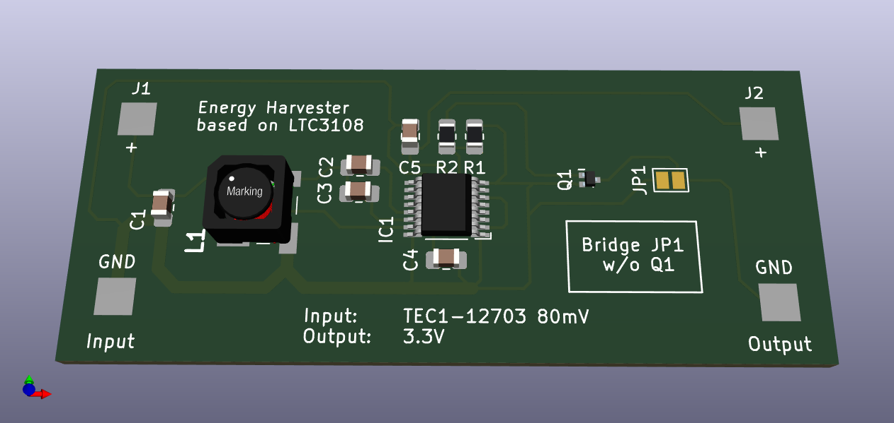

# Energy-harvester
## Description

KiCAD 5.99

## ToDo

- [x] Check footprints
- [x] Make BOM 
- [x] Check schematic

## PCB

## BOM

|# |Designator	|Part #	|Mfr.	|Description |Footprint	|Qty. |
|- |----------- |------ |---- |----------- |--------- |---- |
|1 |C4	|0805ZC105JAT2A|	Kyocera AVX	|10V 1uF	|0805 (2012 mm)	|1|
|2	|C1	|0805ZD106MAT2A|	Kyocera AVX	|10V 10uF	|0805(2012 mm)	|1|
|3	|C5|	0805ZD475KAT4A|	Kyocera AVX|	10V 4.7uF|	0805 (2012 mm)	|1|
|4	|C2, C3|	0805ZC102KAT2A|	Kyocera AVX|	10V 1nF|	0805 (2012 mm)	|2|
|5	|R1|	RCV08051M00JNEA|	Vishay|	1/8W 1MR|	0805 (2012 mm) |1|
|6	|R2|	CRCW0805100RJNEB|	Vishay|	1/8W 100R|	0805 (2012 mm) |1|
|7	|IC1|	LTC3108EGN#TRPBF|	Analog Devices|	LTC3108|	SSOP-16	|1|
|8	|L1|	WE-EHPI 74488540070|	Wuerth|	Ratio 1:100 coupled inductors|	SMD	|1|
|9	|Q1|	RUM002N02|	Rohm|	Mosfet N-Channel|	SOT-723-3	|1|
